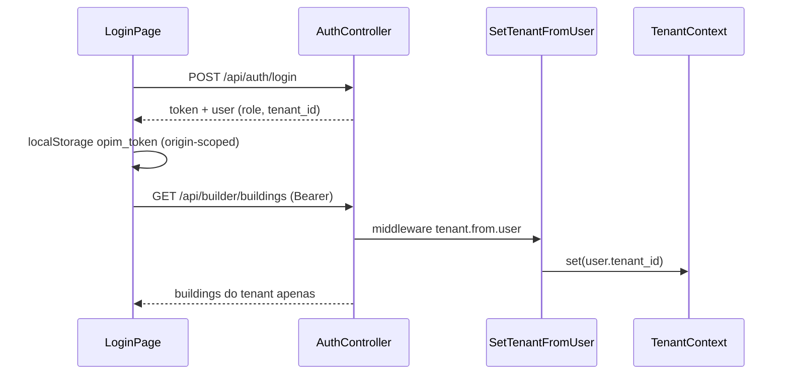
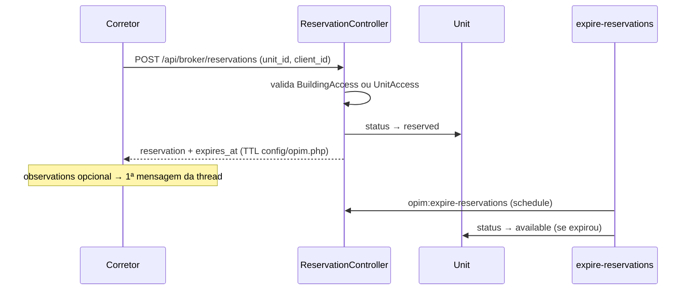
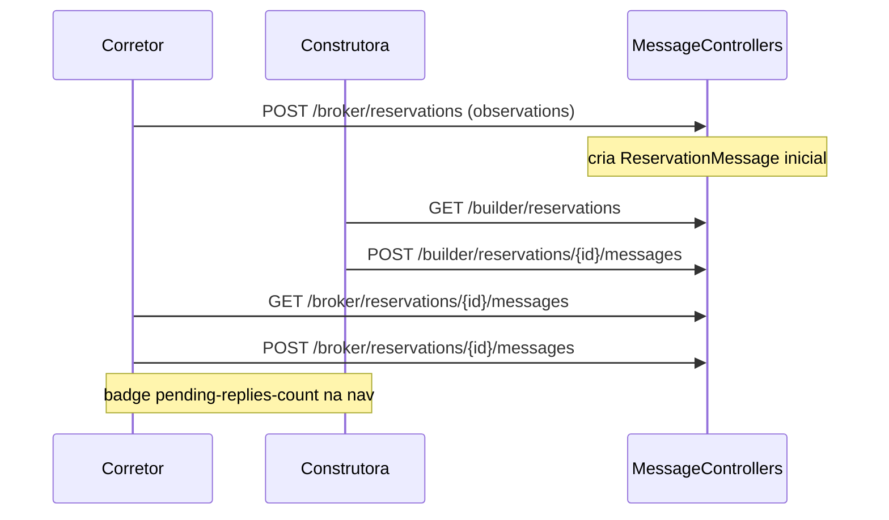
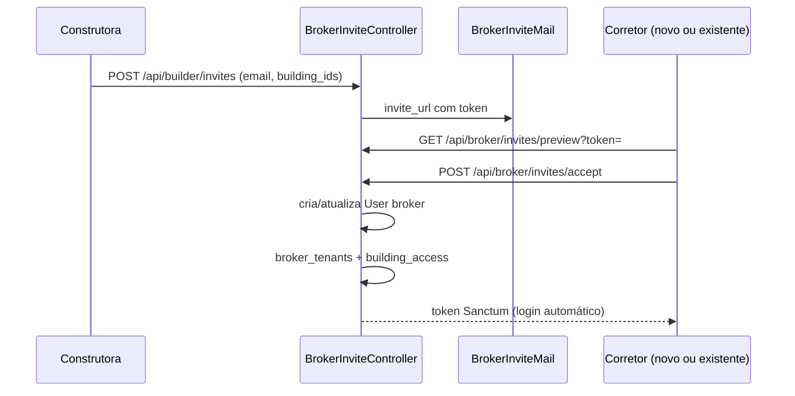
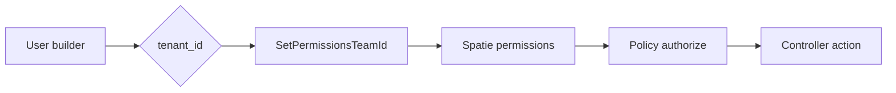
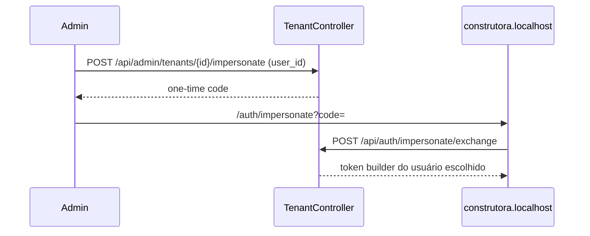

# Flows — fluxos de negócio end-to-end

Diagramas dos caminhos críticos. Para arquivos exatos, ver [TRACEABILITY.md](./TRACEABILITY.md).

---

## 1. Autenticação e tenancy (builder)



**Regras:**

- Builder: `user.tenant_id` → `TenantContext` → global scope `BelongsToTenant`.
- Broker/Admin: **sem** `TenantContext` global (`EnsureNoTenantContext`).
- `SetTenantFromUser` deve rodar **antes** de `SubstituteBindings` (ver `bootstrap/app.php`).

---

## 2. Reserva soft (broker → expiração)



**Arquivos chave:**

- Criação: `Broker/ReservationController.php`
- Expiração: `ReservationExpirationService.php`, `ExpireReservations.php`
- TTL: `config/opim.php` → `reservation_ttl_hours` (default 48h)

---

## 3. Thread de mensagens (reserva)



**Policy:** `ReservationPolicy::viewMessages` — broker só vê próprias reservas; builder precisa `reservations.cancel` + mesmo tenant.

---

## 4. Convite corretor → acesso cross-tenant



**Acesso posterior:**

- Preferencial: `building_access` (empreendimento inteiro).
- Legado: `unit_access` (unidade individual).
- Broker lista unidades via `BrokerUnitAccessService` (união dos dois).

---

## 5. Permissões granulares (equipe builder)



- Catálogo: `BuilderPermissions.php` (8 permissions).
- Atribuição: `TeamMemberController` ou `UserSeeder` (perfis demo).
- FE: `GET /api/auth/me` retorna `permissions[]` → `use-builder-permissions.ts`.

---

## 6. Impersonação admin → builder



**Arquivos:** `Admin/TenantController.php`, `ImpersonatePage.tsx`, `TenantImpersonateDialog.tsx`.

---

## 7. Portal público (read-only)

```
www.localhost → PublicHome → publicApi.getBuildings()
  → GET /api/public/buildings (published=true only)
  → cards com cheapest_unit + cover_image
```

Sem autenticação. Filtro `published` no controller, não no FE.
