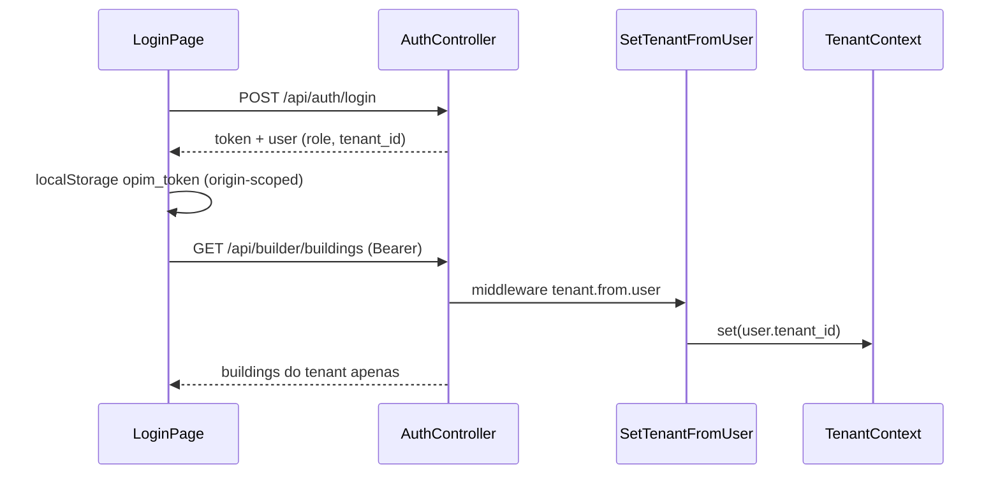
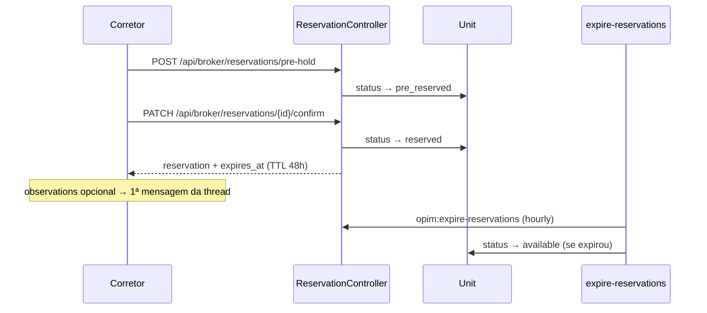
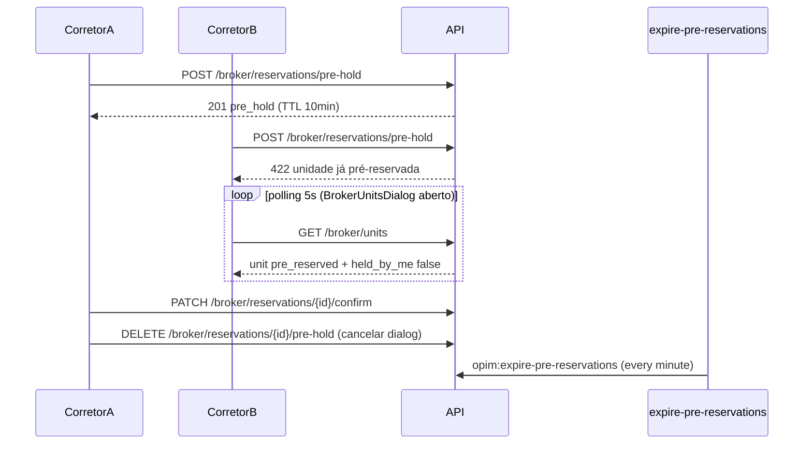
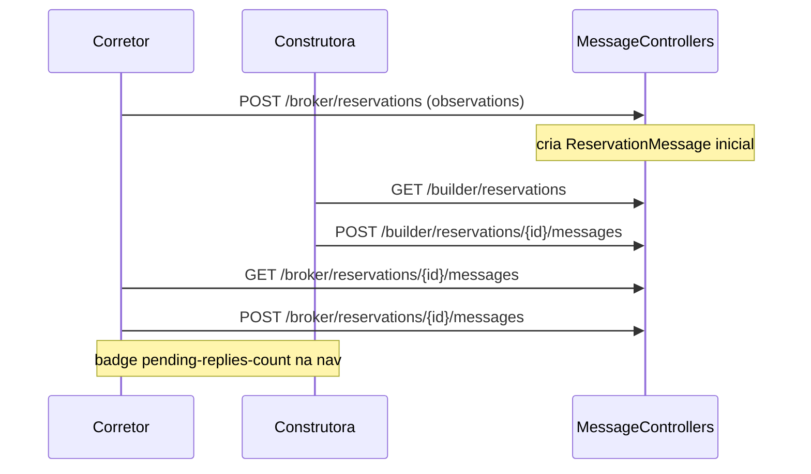
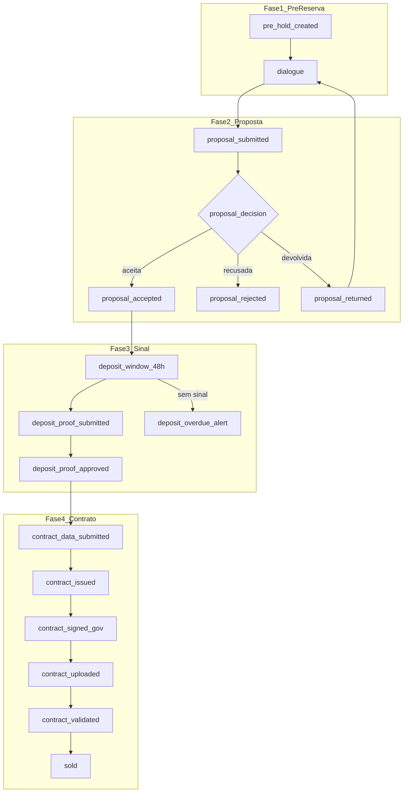
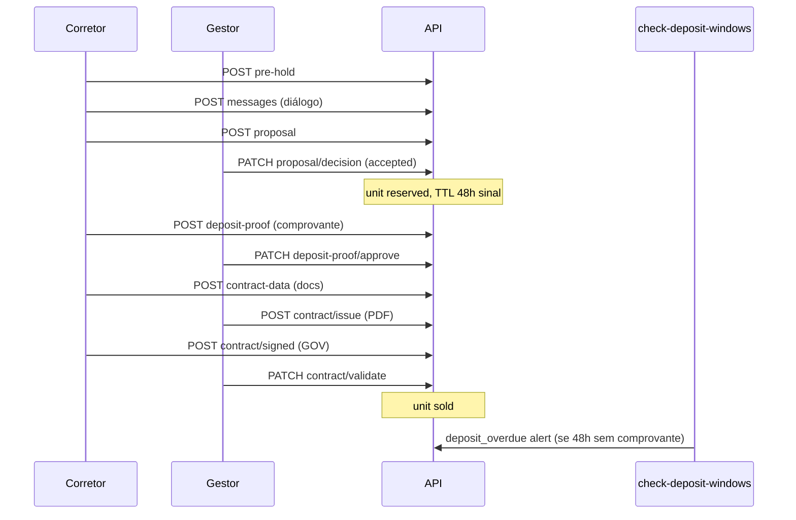
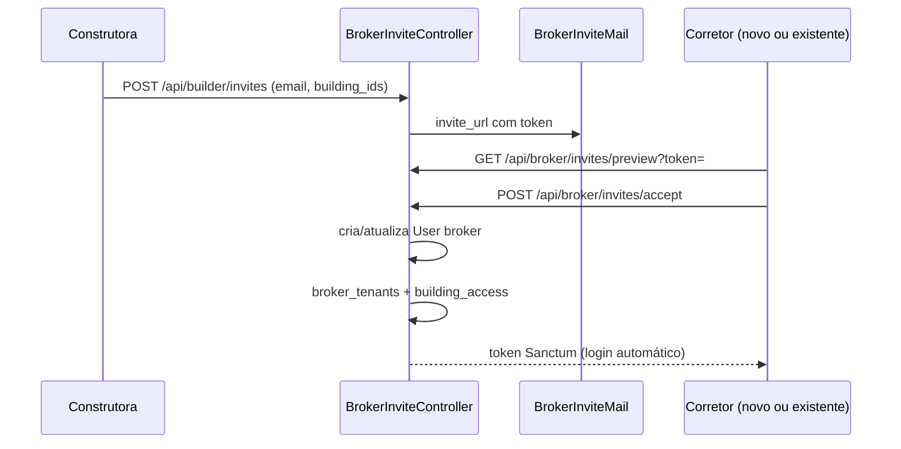
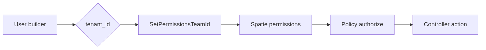
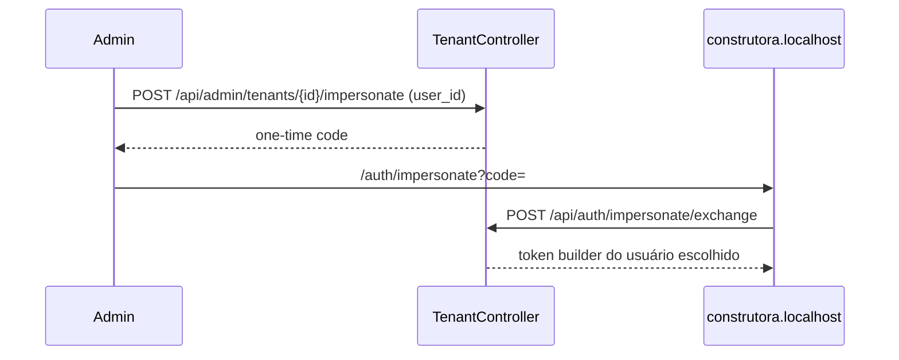

# Flows — fluxos de negócio end-to-end

Diagramas dos caminhos críticos. Para arquivos exatos, ver [TRACEABILITY.md](./TRACEABILITY.md).

---

## 1. Autenticação e tenancy (builder)



**Regras:**

- Builder: `user.tenant_id` → `TenantContext` → global scope `BelongsToTenant`.
- Broker/Admin: **sem** `TenantContext` global (`EnsureNoTenantContext`).
- `SetTenantFromUser` deve rodar **antes** de `SubstituteBindings` (ver `bootstrap/app.php`).

---

## 2. Reserva soft (broker → expiração)

> **v2 (pré-reserva):** fluxo em 2 fases com hold de 10 min antes de confirmar. Ver seção 2.1.



### 2.1 Pré-reserva e concorrência (v2)



**Arquivos chave:**

- Pré-reserva: `PreReservationService.php`, `Broker/ReservationController.php`
- Expiração confirmadas: `ReservationExpirationService.php`, `ExpireReservations.php`
- Expiração pré-holds: `PreReservationService.php`, `ExpirePreReservations.php`
- TTL: `config/opim.php` → `pre_reservation_ttl_minutes` (10), `reservation_ttl_hours` (48)
- FE polling: `frontend/src/lib/reservation-polling.ts`, `BrokerUnitsDialog.tsx`

### 2.2 Cancelamento manual

| Ator | Endpoint | Efeito |
|------|----------|--------|
| Corretor (dono) | `DELETE /api/broker/reservations/{id}` | unit → available, delete reservation |
| Corretor (pre-hold) | `DELETE /api/broker/reservations/{id}/pre-hold` | unit → available, delete draft |
| Construtora | `DELETE /api/builder/reservations/{id}` | unit → available, delete reservation |

Hard delete — sem histórico/auditoria. Mensagens cascade delete.

### 2.3 Matriz de erros (reservas)

| Cenário | HTTP | Mensagem |
|---------|------|----------|
| Sem acesso à unidade | 403 | No access to this unit. |
| Cliente de outro corretor | 403 | Client not found. |
| Unidade indisponível (confirm direto) | 422 | Unit not available for reservation. |
| Pre-hold em unidade held | 422 | Esta unidade acaba de ser pré-reservada por outro corretor. |
| Confirmar hold expirado | 422 | Sua pré-reserva expirou. A unidade está disponível novamente. |
| Broker sem tenant ativo | 403 | Seu acesso ao portal está restrito... |
| Builder sem permission | 403 | Policy deny |
| Polling FE: available → pre_reserved (outro) | — | Toast 1x por unidade/sessão |

**Arquivos chave (legado v1 — POST direto ainda suportado):**

- Criação direta: `Broker/ReservationController.php::store`
- Expiração: `ReservationExpirationService.php`, `ExpireReservations.php`

---

## 3. Thread de mensagens (reserva)



**Policy:** `ReservationPolicy::viewMessages` — broker só vê próprias reservas; builder precisa `reservations.cancel` + mesmo tenant.

---

## 4. Timeline de reserva (pré-reserva → venda)

> Spec: [reservation-timeline/spec.md](../features/reservation-timeline/spec.md) · Design: [reservation-timeline/design.md](../features/reservation-timeline/design.md) · Fonte: [reuniao](../../reuniao) L37–L65

Fluxo completo. Etapas 1–2 já implementadas; 3–12 especificadas.



### 4.1 Sequência por ator



### 4.2 Leitura do timeline

| Endpoint | Ator |
|----------|------|
| `GET /api/broker/reservations/{id}/timeline` | Corretor dono |
| `GET /api/builder/reservations/{id}/timeline` | Gestor (`reservations.cancel`) |

Resposta: `current_stage`, `expires_at`, `steps[]` com status `completed` | `current` | `upcoming` | `skipped` | `failed`.

### 4.3 Regras de negócio

| Regra | Detalhe |
|-------|---------|
| Início | Sempre corretor via pré-reserva |
| Unidade reservada | De proposta aceita até venda (`unit.status = reserved`) |
| TTL 48h | Inicia após aceite da proposta (janela do sinal), não no envio da proposta |
| Proposta devolvida | Corretor corrige e reenvia; diálogo continua |
| Proposta recusada | Encerra fluxo; unidade volta `available` |
| Comprovante vencido | Alerta corretor + gestor; unidade permanece reservada (v1) |

### 4.4 Alinhamento com v2 atual

| Implementado hoje | Próximo passo (Fase B+) |
|-------------------|-------------------------|
| `pre_hold` + mensagens | Timeline steps 1–2 via GET |
| `PATCH confirm` → `confirmed` | Virar envio de proposta |
| Hard delete cancelamento | Soft `cancelled` após `reserved` |

**Arquivos previstos:** ver [reservation-timeline/design.md § Arquivos previstos](../features/reservation-timeline/design.md#arquivos-previstos-implementação).

---

## 5. Convite corretor → acesso cross-tenant



**Acesso posterior:**

- Preferencial: `building_access` (empreendimento inteiro).
- Legado: `unit_access` (unidade individual).
- Broker lista unidades via `BrokerUnitAccessService` (união dos dois).

---

## 6. Permissões granulares (equipe builder)



- Catálogo: `BuilderPermissions.php` (8 permissions).
- Atribuição: `TeamMemberController` ou `UserSeeder` (perfis demo).
- FE: `GET /api/auth/me` retorna `permissions[]` → `use-builder-permissions.ts`.

---

## 7. Impersonação admin → builder



**Arquivos:** `Admin/TenantController.php`, `ImpersonatePage.tsx`, `TenantImpersonateDialog.tsx`.

---

## 8. Portal público (read-only)

```
www.localhost → PublicHome → publicApi.getBuildings()
  → GET /api/public/buildings (published=true only)
  → cards com cheapest_unit + cover_image
```

Sem autenticação. Filtro `published` no controller, não no FE.
