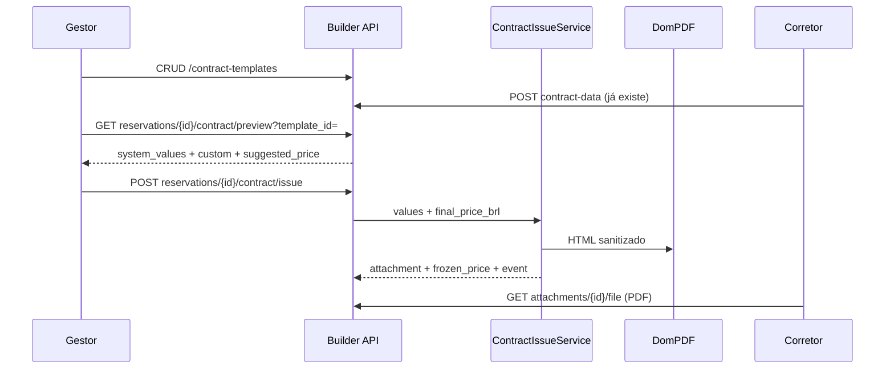

# builder-contracts Design

**Spec:** `.specs/features/builder-contracts/spec.md`
**Status:** Approved

---

## Architecture Overview

Catálogo de modelos no tenant da construtora. Emissão na reserva: resolver variáveis → Markdown → HTML sanitizado → PDF (DomPDF) → `reservation_attachments.kind = contract_pdf`.



## Code reuse

| Existente | Uso |
|-----------|-----|
| `BelongsToTenant` | `ContractTemplate` |
| `BuilderPermissions` | nova `contracts.manage` |
| `ReservationPolicy` | `issueContract` via `reservations.cancel` |
| `ReservationAttachment` + disk `local` | PDF |
| `ReservationTimelineService` | evento `contract_issued`; action `issue_contract` também em `contract_sign_gov` (reemitir) |
| Download autenticado de attachment | corretor e builder já têm `.../attachments/{id}/file` |
| `TeamPage` / BrokersPage | padrão de listagem + form no portal builder |
| Timeline `onAction` | ligar `issue_contract` ao dialog |

## Data models

### `contract_templates`

| Coluna | Tipo |
|--------|------|
| id | PK |
| tenant_id | FK tenants |
| name | string |
| body_markdown | text |
| custom_variables | json `[{slug, label}]` |
| is_active | boolean default true |
| timestamps | |

Unique: `(tenant_id, name)`.

### `units.frozen_price_brl`

decimal 12,2 nullable — preenchido na emissão. Wizard T-05 **não** recria esta coluna.

### `reservations`

| Coluna | Tipo |
|--------|------|
| contract_template_id | FK nullable, nullOnDelete |
| contract_values | json nullable (snapshot dos valores usados) |
| status | inclui `contract_issued` |

## Variáveis do sistema

Classe `App\Support\ContractSystemVariables`. Placeholders `{{slug}}`.

| Grupo | Slugs |
|-------|-------|
| Cliente | `nome_cliente`, `telefone_cliente`, `email_cliente`, `cpf_cliente`, `rg_cliente`, `nacionalidade_cliente`, `estado_civil`, `endereco_cliente`, `cidade_cliente`, `uf_cliente`, `cep_cliente` |
| Cônjuge | `nome_conjuge`, `telefone_conjuge`, `email_conjuge`, `cpf_conjuge`, `rg_conjuge`, `nacionalidade_conjuge` |
| Unidade | `codigo_unidade`, `andar_unidade`, `area_unidade`, `nome_empreendimento`, `preco_final` |
| Proposta | `valor_terreno`, `condicoes_pagamento` |
| Emissão | `nome_corretor`, `data_emissao` |

`preco_final` = `final_price_brl` do request (não o preço INCC ainda volátil). Fonte sugerida: `unit.frozen_price_brl` ?? `unit.price`.

Placeholders no corpo que não estão no catálogo nem em `custom_variables` viram campos obrigatórios na emissão (aviso de typo).

## API

### Catálogo ( `contracts.manage` )

- `GET /api/builder/contract-variables` — lista fechada (slug, label, group)
- `GET /api/builder/contract-templates`
- `POST /api/builder/contract-templates` `{ name, body_markdown, custom_variables, is_active }`
- `PATCH /api/builder/contract-templates/{template}`
- `DELETE /api/builder/contract-templates/{template}` — 204; FKs da reserva ficam null

### Emissão (`reservations.cancel`)

- `GET /api/builder/reservations/{reservation}/contract/preview?template_id=`
  - 422 se stage inválido ou template inativo/outro tenant
  - `{ template, system_values, custom_variables, unknown_placeholders, suggested_price }`
- `POST /api/builder/reservations/{reservation}/contract/issue`
  ```json
  {
    "contract_template_id": 1,
    "values": { "nome_cliente": "...", "comissao_extra": "..." },
    "final_price_brl": 450000.00
  }
  ```
  - 201: `{ status, attachment, frozen_price_brl }`
  - 422: stage inválido, template inativo, valor obrigatório vazio, preço ausente
  - Reemissão: apaga/substitui attachments `contract_pdf` anteriores no disk

Corretor: nenhum endpoint novo; timeline já lista `contract_pdf` para o dono da reserva (ajuste se o filtro atual esconde do broker — ver TRACEABILITY REQ-RTL-018).

## Serviços

- `ContractTemplateService` — CRUD simples
- `ContractVariableResolver` — extrai `{{slug}}`, monta valores do sistema a partir de proposal/unit/building/broker
- `ContractPdfRenderer` — `Str::markdown` (commonmark) + allowlist HTML + DomPDF A4
- `ContractIssueService` — transação: validar stage, resolver, render, storage, attachment, frozen price, timeline event, status

Stage permitido: `contract_data_pending` **com** evento `contract_data_submitted`, ou `contract_issued` sem `contract_signed` / `contract_uploaded`.

## Frontend

| Peça | Onde |
|------|------|
| Nav Contratos | `dashboard-nav.tsx` → `/contracts`; shell filtra `contracts.manage` |
| `ContractsPage` | listagem + criar/editar (nome, ativo, custom vars, editor) |
| `ContractMarkdownEditor` | TipTap StarterKit; serialize Markdown; botões da legenda |
| `BuilderIssueContractDialog` | select modelo ativo, fields de values, R$ final, submit |
| Timeline sheet | `issue_contract` abre o dialog; label Reemitir se já há PDF |
| Broker timeline | link/preview do PDF (`ReservationAttachmentPreview`) |

## Tech decisions

| Decisão | Escolha | Motivo |
|---------|---------|--------|
| PDF | `barryvdh/laravel-dompdf` | PHP puro, cabe no Docker sem Chrome |
| Markdown | `Str::markdown()` (league/commonmark já no Laravel) | sem pacote extra |
| Editor | TipTap | rico, React 19, sem `forwardRef` |
| Preço congelado | coluna em `units` | alinhado ao wizard; UI só aqui |

## Errors

| Cenário | HTTP | UI |
|---------|------|-----|
| Sem `contracts.manage` | 403 | esconde menu |
| Template inativo no issue | 422 | não aparece no select |
| Custom vazia | 422 | erro no field |
| Sem dados de contrato ainda | 422 | botão só no step certo |
| Já assinado | 422 | sem ação reemitir |
