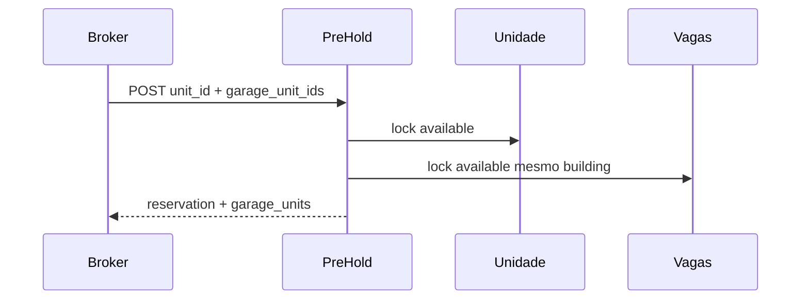

# Design: reservation-garage-spots

**Spec**: `.specs/features/reservation-garage-spots/spec.md`  
**Status**: Approved

## Decisões

| ID | Decisão | Por quê |
|----|---------|---------|
| D-01 | Pivô `reservation_garage_units` | 1 reserva ↔ N vagas; reusa `Unit` (D-R01 do wizard) |
| D-02 | `unit_id` unique no pivô | Uma vaga em no máximo uma reserva |
| D-03 | Limpar pivô em cancel/expire/release | Unique trava reuso se linha ficar |
| D-04 | Manter pivô em `sold` | Histórico da venda |
| D-05 | Sem reserva avulsa de vaga | Produto: vaga só atrelada |
| D-06 | `garage_unit_ids` só no create (pre-hold / store legado) | Sem PATCH nesta fatia |

## Modelo

```
reservation_garage_units
  id, tenant_id, reservation_id (cascade), unit_id (unique), timestamps
```

- `Reservation::garageUnits()` belongsToMany
- `Unit::isGarage()` → `floorRecord?->kind === FloorKind::Garage` (floor_id null = false)

## Fluxo



## Service

`ReservationGarageService`:
- `attach(Reservation, list<int> garageUnitIds, Unit primary)` — valida + sync pivô + status
- `syncStatus(Reservation, UnitStatus)` — aplica status a todas as vagas atreladas
- `detachAndRelease(Reservation)` — status available + detach pivô

## API

```json
{ "unit_id": 10, "garage_unit_ids": [21, 22] }
```

Resposta inclui `garage_units: [{ id, code, price, status, private_area_m2 }]`.  
`BrokerUnitSerializer` expõe `floor_kind`.

## Seeds

Por torre legado: Floor `-1` garage + `S1-01`/`S1-02`. ReservationSeeder atrela 1 vaga; Bosque `101`+`S1-01`.
