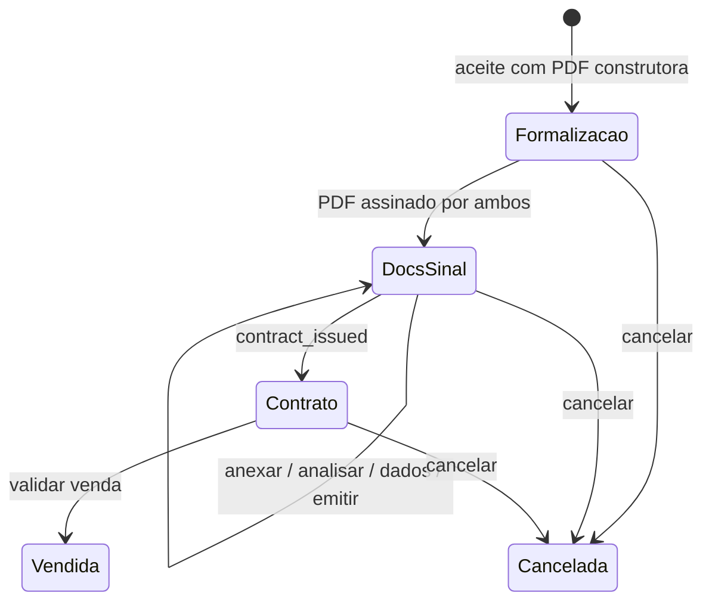
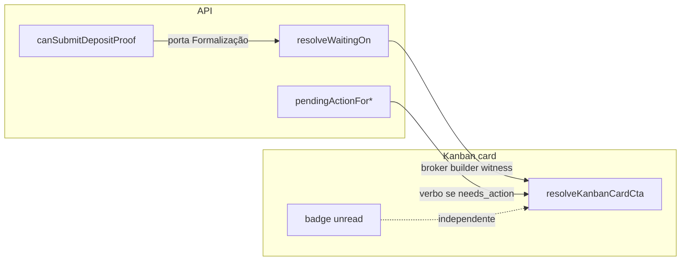

# Design: reservation-kanban-post-proposal

**Spec**: `.specs/features/reservation-kanban-post-proposal/spec.md`  
**Status**: Approved (resumo confirmado; não reabrir discovery)

---

## Architecture Overview

Estende o canal de **fila** já entregue em `reservation-kanban-queue`. Mensagens não mudam.

1. **Fila (bola)** — `situation.current.waiting_on`: `broker` \| `builder` \| `witness` \| `null`.
2. **Ação do viewer** — `pending_action` / `needs_action` (já por usuário). Pós-proposta, o **verbo** do card vem daqui, não de `waiting_on === profile`.
3. **Porta de Formalização** — `canSubmitDepositProof` exige `proposal_signed_both` (exceto hold de cliente na pré-reserva).





---

## Code Reuse Analysis

| Component | Location | How to Use |
|-----------|----------|------------|
| `ReservationTimelineService::resolveWaitingOn` | `backend/app/Services/` | Incluir `witness` em `contract_witness_1/2`; restante da matriz H–S já mapeia broker/builder |
| `ReservationPendingReplyService` | idem | Formalização: só `return_signed_proposal`. Docs & Sinal: adicionar `issue_contract` para gestor quando `contract_issue`. Testemunha já tem prioridade sobre gestor |
| `Reservation::canSubmitDepositProof` | `backend/app/Models/Reservation.php` | Gate: após aceite, só com `proposal_signed_both`; pré-hold com cliente inalterado |
| `ReservationProposalService::returnSigned` | `backend/app/Services/` | Deixar de aceitar `deposit_proof` (sempre 422 se enviado) |
| `ReservationKanbanService::column` | idem | Já coloca emitir em `docs_deposit` (`contract_issued` é que vai para `contract`) |
| `resolveKanbanCardCta` | `frontend/.../reservation-kanban.ts` | Pós-proposta: verbo se `needs_action`; senão label “Aguardando X” |
| `KANBAN_CARD_ACTIONS` | idem | Reusar labels (`Devolver`, `Anexar`, `Emitir`…) |
| `deposit_overdue` | listagem já envia | Alerta no card; não muda `waiting_on` |
| `BrokerReturnSignedProposalDialog` | frontend | Remover campo e payload de comprovante |

`CONCERNS.md`: isolamento tenant — testes de listagem já cobrem; testemunha é user do mesmo tenant.

---

## Components

### `resolveWaitingOn` (estender)

- **Purpose**: dono da bola da **etapa**, incluindo testemunha
- **Location**: `ReservationTimelineService.php`
- **Contrato**: `'broker'|'builder'|'witness'|null`
- **Mudança**: `contract_witness_1` e `contract_witness_2` → `witness` (hoje `builder`)
- **Inalterado**: `deposit_window` / overdue → `broker`; `contract_issue` → `builder`; `sold`/`cancelled` → `null`

### `ReservationPendingReplyService` (estender)

- **Purpose**: verbo que o **viewer** pode executar
- **Broker**: se `canReturnSignedProposal()` → só `return_signed_proposal` (não cair em `submit_deposit_proof`)
- **Builder gestor**: se etapa `contract_issue` / dados já enviados e ainda `contract_data_pending` → `issue_contract`
- **Builder testemunha da vez**: já retorna `witness_signature` **antes** das ações de gestor (desempate REQ-RKP-005)
- **Builder sem gestão e sem vez**: `null` (REQ-RKP-008)

### Porta de Formalização

- `canSubmitDepositProof()`:
  - `hasClientHold()` → permanece `true` (pré-reserva, fora deste recorte)
  - senão: `isDepositPending()` **e** existe anexo `proposal_signed_both`
- `POST /broker/reservations/{id}/proposal/signed`: rejeitar `deposit_proof` se presente (422 validation)
- `POST /broker/reservations/{id}/deposit-proof`: já usa `canSubmitDepositProof` — passa a 422 na Formalização
- Timeline `depositWindowBrokerActions`: se `canReturnSignedProposal()`, retornar só `['return_signed_proposal']`
- OpenAPI: `waiting_on` enum `broker|builder|witness`; documentar que `deposit_proof` não é aceito na devolução

### Frontend CTA

Colunas pós-proposta (`proposal_formalization`, `docs_deposit`, `contract`):

```
se sold|cancelled → null
se proposal_review | pre_reservation → comportamento atual (RKQ)
senão:
  se needs_action && KANBAN_CARD_ACTIONS[pending_action]
    → { label: verbo, hint: hint da ação, interactive: true }
  senão se waiting_on
    → { hint: "Aguardando corretor|construtora|testemunha", interactive: false }
  senão → null
```

`COLUMN_ACTION_ALLOWLIST.docs_deposit` inclui `issue_contract` (hoje está só em `contract`, então o timeline esconde Emitir na coluna certa).

`ReservationWaitingStatus`: incluir `witness` → “Aguardando testemunha”; `waitingOnYou` pós-proposta não deve tratar `waiting_on === profile` quando `waiting_on === 'witness'` (profile é builder). Desempate: `needsAction` já cobre a testemunha da vez.

Alerta I2 no card: se `deposit_overdue && kanban_column === 'docs_deposit'`, texto destructive igual ao da timeline.

---

## Data Models

Sem tabela nova. Contrato JSON:

```typescript
type ReservationWaitingOn = 'broker' | 'builder' | 'witness'
```

`unread_messages_count` e `reservation_message_reads` inalterados.

---

## Error Handling Strategy

| Scenario | Handling | User impact |
|----------|----------|-------------|
| `deposit_proof` na devolução do PDF | 422 validation `deposit_proof` | UI sem o campo; API não aceita |
| `POST deposit-proof` na Formalização | 422 (canSubmitDepositProof false) | botão Anexar não aparece |
| Timeline 403 | não marca read (já RKQ) | badge permanece |
| Viewer builder comum na vez do gestor | `pending_action` null | só “Aguardando construtora” |

---

## Tech Decisions

| ID | Choice | Rationale |
|----|--------|-----------|
| D-01 | `waiting_on=witness` (não user id / slot) | Premissa: card não discrimina T1/T2; evita Emma 2.0 |
| D-02 | Verbo via `pending_action`, não `waiting_on === profile` | Gestor não-testemunha é `builder` mas não tem a bola; “Aguardando você” some nestas colunas |
| D-03 | Rejeitar `deposit_proof` na devolução (não só omitir na UI) | Porta é mudança de fluxo, não só copy |
| D-04 | Pré-hold com cliente continua podendo anexar sinal | Fora do recorte; REQ-RPF-004 |
| D-05 | `issue_contract` como `pending_action` do gestor | Hoje falta na listagem; matriz L exige `Emitir` |
| D-06 | Allowlist `issue_contract` em `docs_deposit` | Coluna do card já é Docs & Sinal até `contract_issued` |
| D-07 | Copy do alerta de atraso = timeline | Lacuna de UX fechada sem inventar visual novo |
| D-08 | Sem endpoint `mark-read` / sem mudar menu nav | Herdado do mapa anterior |
