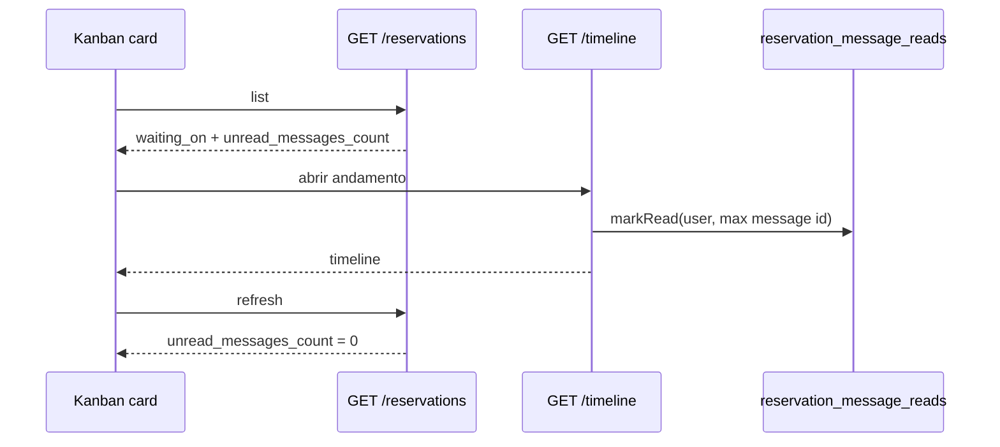

# Design: reservation-kanban-queue

**Spec**: `.specs/features/reservation-kanban-queue/spec.md`  
**Status**: Approved (resumo confirmado; não reabrir discovery)

---

## Architecture Overview

Dois canais no card:

1. **Fila (bola)** — `situation.current.waiting_on` (`broker` \| `builder`). Em pré-reserva segue a última mensagem entre papéis; em proposta segue a etapa.
2. **Mensagem** — `unread_messages_count` por `(reservation_id, user_id)`. Independente da fila.

---

## Code Reuse Analysis

| Component | Location | How to Use |
|-----------|----------|------------|
| `ReservationPendingReplyService::formatListItem` | `backend/app/Services/` | Incluir `unread_messages_count`; restringir `pending_action=reply` a `pre_hold` |
| `ReservationTimelineService::resolveWaitingOn` | idem | Já cobre diálogo vs proposta; só garantir testes da matriz |
| `ReservationTimelineController` (builder/broker) | `Http/Controllers/Api/{Builder,Broker}/` | Side-effect `markRead` no `show` |
| `resolveKanbanCardCta` | `frontend/.../reservation-kanban.ts` | Fila só por `waiting_on` em `proposal_review`; pré-reserva mantém botão de diálogo |
| `ReservationProgressDialog` | `frontend/.../ReservationProgressDialog.tsx` | Já tem `ReservationChatPanel`; refresh da lista após load |
| `ReservationChatPanel` | existente | Sem mudança de regras de anexo |

`CONCERNS.md`: isolamento tenant — testes de listagem já cobrem tenant; reads amarrados à reserva (cascade).

---

## Components

### ReservationMessageRead (model + table)

- **Purpose**: cursor de leitura por usuário
- **Location**: `backend/app/Models/ReservationMessageRead.php`
- **Table**: `reservation_message_reads`
  - `reservation_id` FK cascade
  - `user_id` FK cascade
  - `last_read_message_id` nullable FK `reservation_messages` nullOnDelete
  - unique `(reservation_id, user_id)`
- **Reuses**: padrão `ReservationMessage`

### ReservationMessageReadService

- **Purpose**: contar não lidas da outra parte; persistir cursor
- **Location**: `backend/app/Services/ReservationMessageReadService.php`
- **Interfaces**:
  - `unreadCount(Reservation $reservation, User $viewer): int`
  - `markRead(Reservation $reservation, User $viewer): void`
- **Regra de contagem**: mensagens com `user.role !== viewer.role` e `id > last_read_message_id` (se cursor null, todas as da outra parte)
- **markRead**: `last_read_message_id = max(id)` das mensagens da reserva (todas; as próprias não entram na contagem)

### API

- `GET .../reservations` — campo novo `unread_messages_count: integer`
- `needs_reply` — passa a ser `unread_messages_count > 0` (badge/legado de boolean)
- `GET .../reservations/{id}/timeline` — marca leitura do viewer (GET com side-effect documentado; evita round-trip extra no open do card)
- `POST .../messages` — também `markRead` (enviar implica ter visto o fio)
- Sem endpoint dedicado `mark-read` nesta fatia
- `pending-replies-count` / `pending-actions-count` **não** mudam (lacuna do menu)

### Frontend

- Badge numérico no card (canto do nome), `aria-label` “N mensagens não lidas”
- `resolveKanbanCardCta`:
  - `sold` / `cancelled` → null
  - `pre_reservation` + `needs_action` → botão da ação (`Responder` / `Enviar mensagem`)
  - `pre_reservation` sem ação → label `WAITING_ON_LABEL[waiting_on]`
  - demais colunas (incl. `proposal_review`) → só fila: “Aguardando você” se `waiting_on === profile`, senão “Aguardando corretor/construtora”
- Kanban pages: remover `ReservationMessagesDialog`; kebab “Responder” / “Ver conversa” chama `onTimeline`
- Após `getReservationTimeline` no dialog: `onTimelineRefresh()` para zerar badge na lista

---

## Error Handling Strategy

| Scenario | Handling | User impact |
|----------|----------|-------------|
| Timeline 403 | não marca read | badge permanece |
| Sem mensagens | cursor com `last_read_message_id` null | count 0 |
| Mensagem apagada (cascade) | `nullOnDelete` no FK | count recalcula pelo id restante |

---

## Tech Decisions

| ID | Choice | Rationale |
|----|--------|-----------|
| D-01 | Tabela por user, não por papel | Premissa do resumo |
| D-02 | Mark read no GET timeline | Abrir o card = esse GET |
| D-03 | `reply` só em `pre_hold` | Evita Emma via `needs_action` |
| D-04 | Recusa/devolução: código atual | Já cancela / mantém `proposal_review` |
| D-05 | Sem mudar badge do menu nav | Lacuna aceita |
