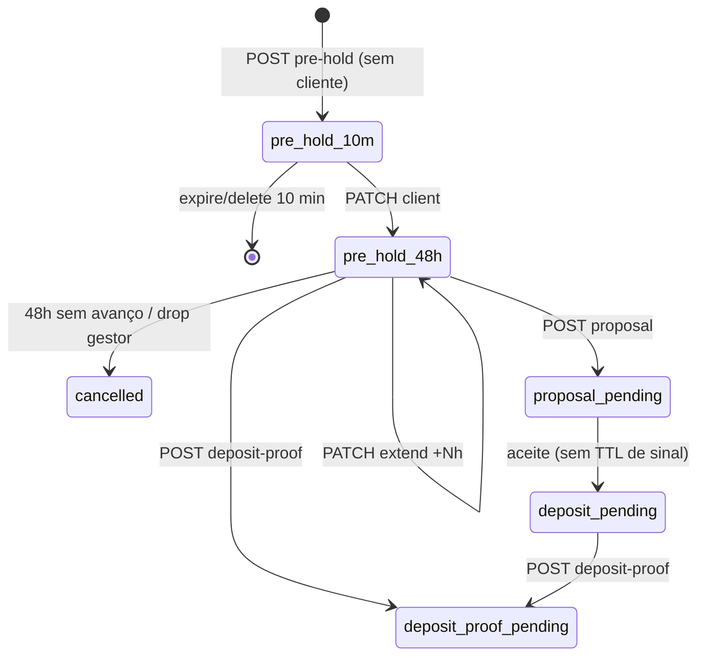

# Design: andamento flexível da reserva

> Spec: [spec.md](./spec.md) · Discovery: [resumo](../../../docs/discovery/resumo-andamento-reserva-flexivel.md)

## Entrega 1 — fundação do hold

Não introduz coluna `situation` ainda. Reusa `reservations.status` + `expires_at` + eventos. Kanban (Entrega 4) deriva a coluna desses campos.

### `unit.status`

| Evento | Unidade |
|--------|---------|
| Pré-hold (10 min ou 48h) | `pre_reserved` |
| Sinal lançado **ou** proposta aceita | `reserved` |
| Queda / recusa / cancelamento | `available` |
| Venda (Entrega 3) | `sold` |

### TTL

| Estado | `expires_at` | Command |
|--------|----------------|---------|
| `pre_hold` sem cliente | +10 min | hard delete (`opim:expire-pre-reservations`) |
| `pre_hold` com cliente | +48h (renovável) | soft `cancelled` + evento `expired` |
| proposta / contrato / sinal lançado | `null` | — |

Config: `pre_reservation_hold_hours` (default 48). O 10 min permanece em `pre_reservation_ttl_minutes`.

### API nova (Entrega 1)

- `PATCH /api/builder/reservations/{id}/hold/extend` `{ hours?: 1–168 }` default 48
- `POST /api/builder/reservations/{id}/hold/drop` `{ reason?: string }`

Ambos: permission `reservations.cancel`. 422 se não for pré-reserva com cliente.

`POST /api/broker/reservations/{id}/deposit-proof` passa a aceitar `pre_hold` com cliente.

### Serviços

- `ReservationHoldService`: extend + drop
- `PreReservationService::expireDuePreHolds`: bifurca sem cliente (delete) vs com cliente (cancel + `expired`)
- `ReservationDepositService::submitProof`: se `pre_hold`, promove unidade a `reserved` e zera TTL
- `ReservationProposalService::accept`: **não** grava TTL de sinal nem evento `deposit_window_opened`

### UI Entrega 1

Dialog de andamento (`ReservationProgressDialog`). Kanban entra na Entrega 4. Novos botões no step current da pré-reserva com cliente.

## Entregas 2–4 (resumo)

2. **Done.** Espelhar `contract-templates` → `proposal-templates`; formalização no aceite (upload do PDF assinado pela construtora). Emitir PDF não avança status. Aceite com arquivo: `POST .../proposal/decision` multipart; recusa/devolução: `PATCH` JSON.
3. **Done.** Tabela `reservation_witnesses`; testemunhas escolhidas no POST do PDF da construtora; assinatura sequencial (comprador → construtora → T1 → T2 → sold só com as 4). Badge `pending_action` no card + `pending-actions-count` no menu (inclui reply). Sem e-mail.
4. Board 7 colunas; PATCH de coluna chama a mesma transição do service (não update solto). Sem coluna `situation` no banco — deriva `kanban_column` de `status` + anexos.

| Coluna (`kanban_column`) | Label | Origem |
|--------------------------|-------|--------|
| `pre_reservation` | Pré-reserva/Diálogo | `pre_hold` |
| `proposal_review` | Proposta em análise | `proposal_pending`, `proposal_returned` |
| `proposal_formalization` | Proposta aceita/Formalização | `deposit_pending` com `proposal_signed_builder` e sem `proposal_signed_both` |
| `docs_deposit` | Documentação & Sinal | `deposit_pending` / `deposit_proof_pending` / `contract_data_pending` (demais) |
| `contract` | Contrato (assinaturas) | `contract_issued`, `contract_uploaded`, `contract_builder_signed` |
| `sold` | Vendida | `sold` |
| `cancelled` | Cancelada | `cancelled` |

`PATCH /api/{builder\|broker}/reservations/{id}/kanban` `{ column, reason? }`:

- Mesma coluna → 200 no-op (list item).
- `cancelled` com `reason` → `ReservationCancellationService` / `drop` / `releasePreHold`.
- `sold` quando o gestor já pode validar → `ReservationContractCompletionService::validate`.
- Demais destinos permitidos → **422** `{ code: action_required, action }` (abre o dialog; não muta).
- Destino inválido → **422** `{ code: invalid_transition }`.

Lista inclui `kanban_column` + `allowed_kanban_moves`. Dialog central substitui o sheet.
