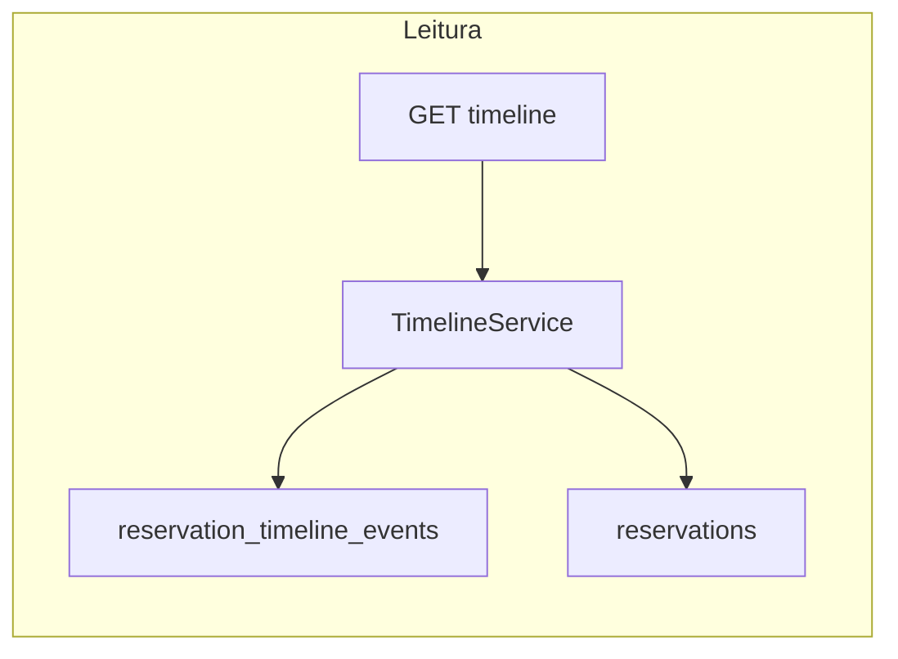
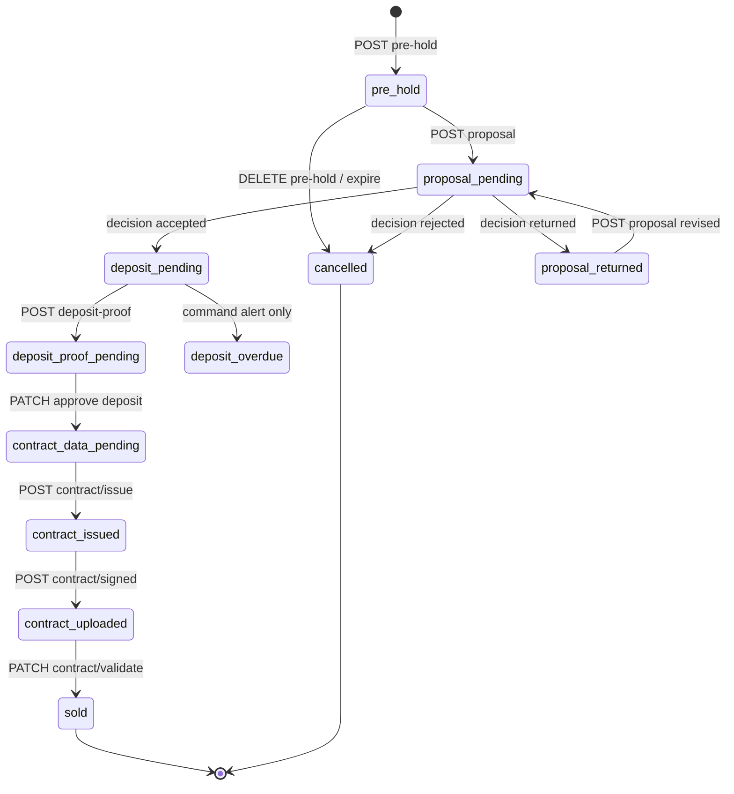

# Design: reservation-timeline

> Spec: [spec.md](./spec.md) · Fonte: [reuniao](../../../reuniao) L37–L65

## Visão geral

Cada reserva possui:

1. **`stage`** — posição atual no fluxo (enum em `reservations.status` ou coluna `stage` dedicada)
2. **`reservation_timeline_events`** — log append-only para renderizar o timeline
3. **`reservation_proposals`** — snapshot do formulário de proposta
4. **`reservation_attachments`** — comprovantes, documentação, PDFs



---

## State machine



### Mapeamento stage → unit.status

| `stage` | `unit.status` | TTL ativo |
|---------|---------------|-----------|
| `pre_hold` | `pre_reserved` | 10 min (pré-reserva) |
| `proposal_pending` | `pre_reserved` | — |
| `proposal_returned` | `pre_reserved` | — |
| `deposit_pending` | `reserved` | 48 h (sinal) |
| `deposit_proof_pending` | `reserved` | — |
| `contract_data_pending` | `reserved` | — |
| `contract_issued` | `reserved` | — |
| `contract_uploaded` | `reserved` | — |
| `sold` | `sold` | — |
| `cancelled` | `available` | — |
| `expired` | `available` | — |

### Migração do enum atual

| Valor atual (`ReservationStatus`) | Valor alvo |
|-----------------------------------|------------|
| `pre_hold` | `pre_hold` (mantém) |
| `confirmed` | `deposit_pending` (reservas com TTL ativo) ou `reserved` (sem TTL) |

---

## Etapas do timeline (UI)

Ordem fixa exibida ao usuário. Steps sem evento ainda = `upcoming`; step do `current_stage` = `current`.

| Ordem | `key` | Label (pt-BR) | Evento(s) |
|-------|-------|---------------|-----------|
| 1 | `pre_hold_created` | Pré-reserva | `pre_hold_created` |
| 2 | `dialogue` | Diálogo com construtora | `dialogue` (derivado de `messages_count > 0`) |
| 3 | `proposal_submitted` | Proposta enviada | `proposal_submitted` |
| 4 | `proposal_decision` | Decisão do gestor | `proposal_accepted` \| `proposal_rejected` \| `proposal_returned` |
| 5 | `deposit_window` | Aguardando sinal (48h) | `deposit_window_opened`, `deposit_overdue` |
| 6 | `deposit_proof` | Comprovante de pagamento | `deposit_proof_submitted`, `deposit_proof_approved` |
| 7 | `contract_data` | Dados para contrato | `contract_data_submitted` |
| 8 | `contract_issue` | Emissão do contrato | `contract_issued` |
| 9 | `contract_sign_gov` | Assinatura GOV | `contract_signed_gov` (registro manual v1) |
| 10 | `contract_upload` | Contrato assinado enviado | `contract_uploaded` |
| 11 | `contract_validate` | Validação final | `contract_validated` |
| 12 | `sold` | Unidade vendida | `sold` |

**Regra de skip:** se `proposal_rejected`, steps 5–12 = `skipped`. Se `cancelled` em `pre_hold`, steps 3–12 = `skipped`.

---

## Modelo de dados

### `reservations` (alterações)

| Campo | Alteração |
|-------|-----------|
| `status` | Expandir enum (ver state machine) |
| `expires_at` | TTL pré-reserva (10 min) ou janela sinal (48h pós-aceite) |
| `client_id` | Preenchido ao aceitar proposta (vincula `BrokerClient`) |

### `reservation_proposals`

| Campo | Tipo | Descrição |
|-------|------|-----------|
| `id` | PK | |
| `reservation_id` | FK | |
| `version` | int | Incrementa a cada reenvio após `returned` |
| `client_name` | string | |
| `client_email` | string | |
| `client_phone` | string | |
| `client_cpf` | string | |
| `address` | string | |
| `city` | string | |
| `state` | string | |
| `zip` | string | |
| `marital_status` | string | |
| `nationality` | string | |
| `land_value` | decimal | Valor do terreno |
| `payment_terms` | text | Condições de pagamento |
| `decision` | enum nullable | `accepted` \| `rejected` \| `returned` |
| `decision_note` | text nullable | Motivo devolução/recusa |
| `submitted_by` | FK users | Corretor |
| `decided_by` | FK users nullable | Gestor |
| `decided_at` | timestamp nullable | |
| timestamps | | |

### `reservation_timeline_events`

| Campo | Tipo | Descrição |
|-------|------|-----------|
| `id` | PK | |
| `reservation_id` | FK | |
| `type` | string | Ver tabela abaixo |
| `actor_id` | FK users nullable | Quem executou (null = sistema) |
| `payload` | JSON | Metadados (nota, attachment_id, proposal_id) |
| `created_at` | timestamp | |

**Tipos de evento (`type`):**

```
pre_hold_created
dialogue
proposal_submitted
proposal_accepted
proposal_rejected
proposal_returned
deposit_window_opened
deposit_overdue
deposit_proof_submitted
deposit_proof_approved
contract_data_submitted
contract_issued
contract_signed_gov
contract_uploaded
contract_validated
sold
cancelled
expired
```

### `reservation_attachments`

| Campo | Tipo | Descrição |
|-------|------|-----------|
| `id` | PK | |
| `reservation_id` | FK | |
| `kind` | enum | `deposit_proof` \| `contract_documentation` \| `contract_pdf` \| `contract_signed` |
| `path` | string | Storage disk `local` |
| `original_name` | string | |
| `mime_type` | string | |
| `uploaded_by` | FK users | |
| timestamps | | |

Padrão de upload: [`BuildingMediaController`](../../../backend/app/Http/Controllers/Api/Builder/BuildingMediaController.php).

---

## Contratos API

### Timeline (leitura)

#### `GET /api/broker/reservations/{reservation}/timeline`

#### `GET /api/builder/reservations/{reservation}/timeline`

**200:**

```json
{
  "reservation_id": 42,
  "current_stage": "deposit_pending",
  "expires_at": "2026-07-12T18:00:00+00:00",
  "unit": { "id": 10, "code": "101", "status": "reserved" },
  "steps": [
    {
      "key": "pre_hold_created",
      "label": "Pré-reserva",
      "status": "completed",
      "occurred_at": "2026-07-10T14:00:00+00:00",
      "actor": { "id": 5, "name": "João Corretor", "role": "broker" }
    },
    {
      "key": "deposit_window",
      "label": "Aguardando sinal (48h)",
      "status": "current",
      "due_at": "2026-07-12T18:00:00+00:00",
      "actions": ["submit_deposit_proof"]
    },
    {
      "key": "sold",
      "label": "Unidade vendida",
      "status": "upcoming"
    }
  ]
}
```

**Actions por perfil (exemplos):**

| `current_stage` | Corretor | Gestor |
|-----------------|----------|--------|
| `pre_hold` | `submit_proposal`, `open_dialogue` | `open_dialogue` |
| `proposal_pending` | — | `decide_proposal` |
| `proposal_returned` | `submit_proposal` | — |
| `deposit_pending` | `submit_deposit_proof` | — |
| `deposit_proof_pending` | — | `approve_deposit_proof` |
| `contract_data_pending` | `submit_contract_data` | — |
| `contract_issued` | `mark_signed_gov`, `upload_signed_contract` | — |
| `contract_uploaded` | — | `validate_contract` |

---

### Proposta

#### `POST /api/broker/reservations/{reservation}/proposal`

**Body:**

```json
{
  "client_name": "Maria Silva",
  "client_email": "maria@email.com",
  "client_phone": "11999999999",
  "client_cpf": "12345678900",
  "address": "Rua A, 100",
  "city": "São Paulo",
  "state": "SP",
  "zip": "01000-000",
  "marital_status": "casada",
  "nationality": "brasileira",
  "land_value": 150000.00,
  "payment_terms": "Pix R$ 10.000 + terreno + 24x R$ 5.000"
}
```

**201:** proposta criada + `stage: proposal_pending` + evento `proposal_submitted`

**422:** stage inválido, pré-reserva expirada, campos obrigatórios

#### `PATCH /api/builder/reservations/{reservation}/proposal/decision`

**Body:**

```json
{
  "decision": "accepted",
  "decision_note": "opcional"
}
```

`decision`: `accepted` | `rejected` | `returned`

**200:** stage atualizado conforme decisão

---

### Sinal

#### `POST /api/broker/reservations/{reservation}/deposit-proof`

`multipart/form-data`: `file` (comprovante)

**201:** attachment + evento `deposit_proof_submitted` + `stage: deposit_proof_pending`

#### `PATCH /api/builder/reservations/{reservation}/deposit-proof/approve`

**200:** evento `deposit_proof_approved` + `stage: contract_data_pending`

---

### Contrato

#### `POST /api/broker/reservations/{reservation}/contract-data`

`multipart/form-data`: campos do cliente (opcional se já na proposta) + `files[]` (documentação)

**201:** evento `contract_data_submitted`

#### `POST /api/builder/reservations/{reservation}/contract/issue`

**Body (v1 upload manual):** `multipart/form-data` com `file` (PDF) ou geração futura

**201:** attachment `contract_pdf` + evento `contract_issued` + `stage: contract_issued`

#### `POST /api/broker/reservations/{reservation}/contract/signed`

`multipart/form-data`: `file` (PDF assinado GOV)

**201:** evento `contract_uploaded` + `stage: contract_uploaded`

#### `PATCH /api/builder/reservations/{reservation}/contract/validate`

**200:** evento `contract_validated` + `sold` + `unit.status: sold`

---

## Commands

| Command | Schedule | Ação |
|---------|----------|------|
| `opim:expire-pre-reservations` | every minute | Mantém (libera `pre_hold` expirado) |
| `opim:check-deposit-windows` | hourly | Gera `deposit_overdue` + notifica (não cancela por padrão) |
| `opim:expire-reservations` | revisar | Política depende de D-04 |

---

## Config (`config/opim.php`)

```php
'pre_reservation_ttl_minutes' => env('OPIM_PRE_RESERVATION_TTL_MINUTES', 10),
'deposit_window_hours' => env('OPIM_DEPOSIT_WINDOW_HOURS', 48), // renomear de reservation_ttl_hours
```

---

## Frontend

### Componente `ReservationTimeline`

- Local: `frontend/src/components/reservations/ReservationTimeline.tsx`
- Props: `reservationId`, `profile: 'broker' | 'builder'`
- Consome `GET .../timeline`
- Step `current` renderiza botões conforme `actions[]`
- Etapa `dialogue` abre `ReservationMessagesDialog` existente

### Integração

| Página | Alteração |
|--------|-----------|
| `BrokerReservationsPage.tsx` | Drawer/detalhe com timeline |
| `ReservationsPage.tsx` (builder) | Drawer/detalhe com timeline + ações gestor |

---

## Decisões pendentes

Ver [spec.md § Decisões pendentes](./spec.md#decisões-pendentes).

**Recomendações v1:**

- **D-01:** Gestor pode cancelar até `contract_uploaded`; corretor só cancela em `pre_hold` e `proposal_returned`
- **D-02:** Registro manual + upload (sem API gov.br)
- **D-03:** Upload manual do PDF pelo gestor na v1; template automático em v2
- **D-04:** Alerta apenas na v1 (reunião); command `opim:check-deposit-windows`
- **D-05:** `confirmed` → `deposit_pending` se `expires_at` futuro; senão `reserved`

---

## Fases de implementação

| Fase | Escopo | Gate |
|------|--------|------|
| **A** | Migrations, enums, `timeline_events`, GET timeline mapeando `pre_hold` + mensagens | Pest + Vitest `ReservationTimeline` |
| **B** | Proposta (form corretor + decisão gestor); migrar `confirm` | Feature tests + OpenAPI |
| **C** | Sinal (upload comprovante + aprovação + alerta 48h) | Command + badge/notificação |
| **D** | Contrato (dados, PDF, upload assinado, venda) | Teste manual E2E |

---

## Arquivos previstos (implementação)

| Camada | Arquivo |
|--------|---------|
| Enum | `app/Enums/ReservationStage.php` (ou expandir `ReservationStatus`) |
| Enum | `app/Enums/ReservationTimelineEventType.php` |
| Model | `app/Models/ReservationProposal.php` |
| Model | `app/Models/ReservationTimelineEvent.php` |
| Model | `app/Models/ReservationAttachment.php` |
| Service | `app/Services/ReservationTimelineService.php` |
| Controller | `app/Http/Controllers/Api/Broker/ReservationTimelineController.php` |
| Controller | `app/Http/Controllers/Api/Builder/ReservationTimelineController.php` |
| FE | `frontend/src/components/reservations/ReservationTimeline.tsx` |
| Test | `tests/Feature/Reservations/ReservationTimelineTest.php` |
