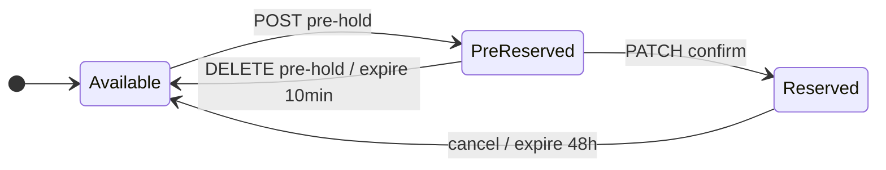

# Design: reservations

> **Evolução:** o fluxo completo (proposta → sinal → contrato → venda) está especificado em [reservation-timeline/design.md](../reservation-timeline/design.md). O `PATCH confirm` atual será realinhado para **envio de proposta** na Fase B.

## Modelo de dados (v2 atual — pré-reserva)

### Tabela `reservations`

| Campo | Tipo | Descrição |
|-------|------|-----------|
| `id` | PK | |
| `tenant_id` | FK | Construtora dona da unidade |
| `unit_id` | FK unique | 1 reserva ativa por unidade |
| `broker_id` | FK | Corretor |
| `client_id` | FK nullable | Obrigatório em `confirmed`; null em `pre_hold` |
| `status` | enum | `pre_hold` \| `confirmed` (ver timeline para stages futuros) |
| `expires_at` | timestamp | TTL distinto por status |
| timestamps | | |

### State machine (v2 implementado)



| status reserva | unit.status | client_id | TTL |
|----------------|-------------|-----------|-----|
| `pre_hold` | `pre_reserved` | null | 10 min |
| `confirmed` | `reserved` | required | 48 h |

### Depreciação planejada

| Endpoint/comportamento v2 | Alvo (reservation-timeline) |
|---------------------------|----------------------------|
| `PATCH confirm` confirma reserva direto | Envia **proposta** → `proposal_pending` |
| `confirmed` + TTL 48h imediato | TTL 48h só após **aceite da proposta** (sinal) |
| `observations` no confirm | `payment_terms` em `reservation_proposals` |
| Cancelamento hard delete | Soft `cancelled` após `reserved` (preserva timeline) |

## Contratos API (broker)

### POST `/api/broker/reservations/pre-hold`

```json
{ "unit_id": 10 }
```

**201:** `{ id, unit_id, broker_id, status: "pre_hold", expires_at, unit }`

**422:** `{ "message": "Esta unidade acaba de ser pré-reservada por outro corretor." }`

### PATCH `/api/broker/reservations/{id}/confirm`

```json
{ "client_id": 3, "observations": "opcional" }
```

**200:** reservation confirmada (`status: confirmed`, TTL 48h)

### DELETE `/api/broker/reservations/{id}/pre-hold`

Libera hold sem confirmar. **204**

### POST `/api/broker/reservations` (legado)

Criação direta em 1 passo — mantido para compatibilidade/testes.

## Listagem de unidades enriquecida

```json
{
  "id": 10,
  "code": "101",
  "status": "pre_reserved",
  "pre_hold": {
    "reservation_id": 42,
    "expires_at": "...",
    "held_by_me": false
  }
}
```

## Commands

| Command | Schedule | Ação |
|---------|----------|------|
| `opim:expire-pre-reservations` | every minute | libera units `pre_reserved` expiradas |
| `opim:expire-reservations` | hourly | libera units `reserved` expiradas |

## Config

```php
'pre_reservation_ttl_minutes' => env('OPIM_PRE_RESERVATION_TTL_MINUTES', 10),
'reservation_ttl_hours' => env('OPIM_RESERVATION_TTL_HOURS', 48),
```
