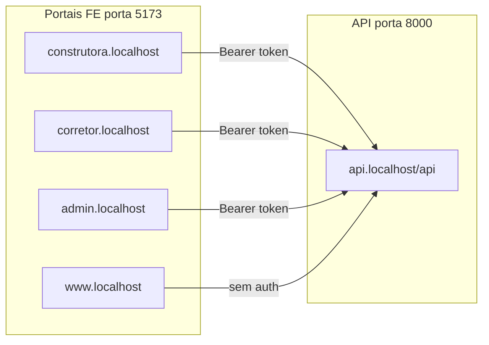

# Design: subdomain-portals

## Visão geral

A mudança é de **portal de entrada** (host → perfil), não de autorização de dados. Backend permanece com prefixos por perfil e middlewares existentes.



## Mapa de hosts (dev)

| Host | Perfil | App montado | Auth |
|------|--------|-------------|------|
| `construtora.localhost:5173` | `builder` | `BuilderHome` | Sim |
| `corretor.localhost:5173` | `broker` | `BrokerHome` | Sim |
| `admin.localhost:5173` | admin | `AdminHome` | Sim |
| `www.localhost:5173` | `public` | `PublicHome` | Não |
| `api.localhost:8000` | — | Laravel API | — |

## Componentes novos (frontend)

```
frontend/src/
├── lib/
│   ├── profile.ts          # hostname PT → 'builder' | 'broker' | 'admin' | 'public' | null
│   └── profile.test.ts
└── components/auth/
    ├── ProfileGuard.tsx    # valida token presente + role === perfilDoHost
    └── ProfileGuard.test.tsx
```

### `profile.ts`

```ts
// Mapeamento fixo dev/prod
const HOST_PROFILE: Record<string, PortalProfile> = {
  'construtora.localhost': 'builder',
  'corretor.localhost': 'broker',
  'admin.localhost': 'admin',
  'www.localhost': 'public',
}

export function resolveProfile(hostname: string): PortalProfile | null
export function profileHomeUrl(profile: PortalProfile): string
export function isRoleAllowedOnProfile(role: string, profile: PortalProfile): boolean
```

### `App.tsx` — router por host

Cada subdomínio monta **apenas** as rotas do seu perfil:

| Perfil | Rotas |
|--------|-------|
| builder, broker, admin (roles) | `/login`, `/` (guard) |
| `public` | `/` |
| host desconhecido (`localhost`) | página de orientação com links para subdomínios |

### `ProfileGuard.tsx`

- Sem token → redirect `/login`
- Token presente + `GET /api/auth/me` → valida `role` vs host
- Role mismatch → logout local + redirect `/login` com mensagem

### `LoginPage.tsx` — fluxo revisado

1. Usuário acessa `{perfil}.localhost:5173/login`
2. `POST api.localhost:8000/api/auth/login`
3. Se `!isRoleAllowedOnProfile(user.role, profile)` → erro "Conta não autorizada neste portal"
4. Se OK → `saveToken` + `navigate('/')` no mesmo host

## Sessão e storage

`localStorage` (`opim_token`) é **origin-scoped**. Cada subdomínio tem storage isolado:

- Login em `construtora.localhost` não autentica em `corretor.localhost`
- Comportamento **desejado** — isolamento entre portais
- Migração futura para cookie com `domain` compartilhado fica fora de escopo

## Infra dev

### Sem reverse proxy obrigatório

- Chrome resolve `*.localhost` → `127.0.0.1` nativamente
- Mesmo container Vite (`:5173`) atende todos os hosts FE via header `Host`
- Backend `php artisan serve` (`:8000`) atende `api.localhost`

### `/etc/hosts` (fallback)

```
127.0.0.1 construtora.localhost
127.0.0.1 corretor.localhost
127.0.0.1 admin.localhost
127.0.0.1 www.localhost
127.0.0.1 api.localhost
```

### Docker Compose — variáveis

```yaml
backend:
  APP_URL: http://api.localhost:8000
  CORS_ALLOWED_ORIGINS: "http://construtora.localhost:5173,http://corretor.localhost:5173,http://admin.localhost:5173,http://www.localhost:5173"
  SANCTUM_STATEFUL_DOMAINS: "construtora.localhost,corretor.localhost,admin.localhost,www.localhost,api.localhost"

frontend:
  VITE_API_URL: http://api.localhost:8000/api
```

### Vite

```ts
server: {
  host: true,
  port: 5173,
  allowedHosts: ['construtora.localhost', 'corretor.localhost', 'admin.localhost', 'www.localhost'],
}
```

## Backend — CORS

Publicar `backend/config/cors.php` lendo `CORS_ALLOWED_ORIGINS` (env hoje existe em `docker-compose.yml` mas não está ligada ao Laravel).

```php
'allowed_origins' => explode(',', env('CORS_ALLOWED_ORIGINS', '')),
'paths' => ['api/*', 'sanctum/csrf-cookie'],
'supports_credentials' => false,
```

Feature test Pest: preflight `OPTIONS` com `Origin: http://construtora.localhost:5173` retorna `Access-Control-Allow-Origin`.

## API e domínio (EN)

- [`backend/routes/api.php`](../../../backend/routes/api.php) — prefixos `/api/builder/*`, `/api/broker/*`, `/api/admin/*`, `/api/public/*`
- Middlewares `EnsureBuilder`, `EnsureBroker`, `EnsureAdmin`, tenancy
- `builderApi`, `brokerApi`, `adminApi`, `publicApi` em `api.ts`
- Modelo `unit_access` para broker cross-tenant
- Subdomínios de dev permanecem PT; profile keys e roles usam EN (`builder`, `broker`)

## Produção (deferred — REQ-SUB-012)

| Dev | Prod (exemplo) |
|-----|----------------|
| `construtora.localhost` | `construtora.oportalimobiliario.com.br` |
| `corretor.localhost` | `corretor.oportalimobiliario.com.br` |
| `admin.localhost` | `admin.oportalimobiliario.com.br` |
| `www.localhost` | `www.diadimoveis.com.br` |
| `api.localhost` | `api.oportalimobiliario.com.br` |

Requer DNS wildcard + certificado SSL. `profile.ts` deve aceitar hosts de prod via env ou mapa extensível.

## Riscos

| Risco | Mitigação |
|-------|-----------|
| CORS não configurado | Publicar `cors.php` + teste Pest |
| Browser sem `*.localhost` | README com `/etc/hosts` |
| Paths antigos quebrados | Página de orientação em `localhost:5173` |
| Role errada no portal | Guard + validação no login |
