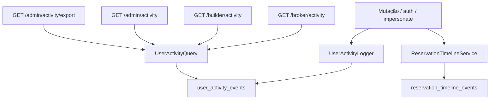

# Design: user-activity-log

**Spec**: `.specs/features/user-activity-log/spec.md`  
**Context**: `.specs/features/user-activity-log/context.md`  
**Status**: Draft

---

## Architecture Overview

Log **da pessoa**, complementar a `reservation_timeline_events` (log da reserva). Escrita explícita no ponto da mutação via `UserActivityLogger` — sem observers genéricos (frases humanas + old/new exigem contexto).

Impersonate detectado pelo nome do token Sanctum já existente: `impersonate:{admin_id}`. Mutação nesse token grava **dois** INSERTs (ator impersonado + admin).

---

## Code Reuse

| Componente | Local | Uso |
|------------|-------|-----|
| Padrão append-only | `ReservationTimelineEvent` | `$timestamps = false`, `created_at` no `creating`, sem rotas de update/delete |
| Token impersonate | `AuthController::exchangeImpersonation` | `createToken('impersonate:'.$adminId)` — fonte da delegação |
| Catálogo Spatie | `BuilderPermissions` | Nova constante `VIEW_AUDIT = 'audit.view'` |
| Nav + filtro permission | `dashboard-nav.tsx`, `BuilderDashboardShell` | Item **Atividade**; visível a todos autenticados do portal |
| Cliente HTTP | `frontend/src/lib/api.ts` | `builderApi` / `brokerApi` / `adminApi` |
| Checkboxes equipe | `TeamPage.tsx` + `BUILDER_PERMISSIONS` | `audit.view` entra no catálogo automaticamente |

**Não** adicionar pacote de audit (ex.: owen-it/laravel-auditing).

---

## Data model

### `user_activity_events`

| Coluna | Tipo | Notas |
|--------|------|-------|
| `id` | PK | |
| `actor_user_id` | FK `users` nullable, `nullOnDelete` | Nulo só em login falho de identificador desconhecido |
| `tenant_id` | FK `tenants` nullable, `nullOnDelete` | Contexto da ação; nulo em auth admin / login falho sem tenant |
| `action` | string | Valor do enum `UserActivityAction` |
| `resource_type` | string nullable | Ex.: `reservation`, `client`, `unit` |
| `resource_id` | unsignedBigInteger nullable | Pode apontar para recurso já apagado (esperado) |
| `message` | text | Frase humana PT-BR — fonte da auditoria e do CSV |
| `old_values` | json nullable | Snapshot relevante |
| `new_values` | json nullable | Snapshot relevante |
| `impersonator_user_id` | FK `users` nullable, `nullOnDelete` | Preenchido no log da **vítima** |
| `impersonated_user_id` | FK `users` nullable, `nullOnDelete` | Preenchido no log do **admin** |
| `created_at` | timestamp | Sem `updated_at` |

Índices: `(actor_user_id, created_at)`, `(tenant_id, created_at)`, `(action, created_at)`.

**Sem** trait `BelongsToTenant` — broker é cross-tenant; admin é cross-tenant; login falho não tem tenant. Isolamento é query explícita.

Model recusa `updating` / `deleting` (`LogicException`). Sem rotas de mutação do evento.

### Enum `UserActivityAction`

Códigos estáveis para filtro. Catálogo v1:

| Grupo | Actions |
|-------|---------|
| Auth | `auth.login`, `auth.logout`, `auth.login_failed` |
| Impersonate | `impersonate.start`, `impersonate.stop` |
| Cliente | `client.created`, `client.updated`, `client.deleted` |
| Reserva | `reservation.pre_hold.created`, `.cancelled`, `.confirmed`; `reservation.created`; `reservation.cancelled`; `reservation.message.sent`; `reservation.proposal.submitted/.accepted/.rejected/.returned`; `reservation.deposit_proof.submitted/.approved`; `reservation.contract_data.submitted`; `reservation.contract.issued/.uploaded/.validated`; `reservation.sold` |
| Empreendimento | `building.created/.updated/.deleted/.published`; `tower.created/.updated/.deleted`; `unit.created/.updated/.deleted`; `unit.status_changed` |
| Equipe / acesso | `team.member.created/.updated/.deleted`; `broker_invite.created/.revoked`; `building_access.granted/.revoked` |
| Admin | `tenant.created`, `tenant.updated` |

---

## Components

### `UserActivityLogger`

- **Location**: `backend/app/Services/UserActivityLogger.php`
- **Purpose**: único ponto de INSERT.
- **Interface**: `record(UserActivityAction $action, string $message, ?User $actor, ?int $tenantId, ?string $resourceType, ?int $resourceId, ?array $oldValues, ?array $newValues, ?int $impersonatorUserId = null): void`
- Se `$impersonatorUserId` vier (ou for detectado no token `impersonate:{id}`): INSERT no log do ator **e** INSERT no log do admin, com as FKs de delegação e mensagem indicando quem operou em nome de quem.
- Falha de escrita **não** deve abortar a mutação de negócio? **Não** — se o log falhar, a transação da mutação falha (mesmo ponto de escrita). Chamadas de auth (login falho) capturam depois da decisão, sem rollback de login (não há transação).

### `UserActivityQuery`

- **Location**: `backend/app/Services/UserActivityQuery.php`
- Filtros: `from`, `to` (datetime ISO, default últimos 30 dias na UI; API aceita qualquer intervalo), `tenant_id`, `actor_user_id`, `action`.
- Escopos:
  - broker: `actor_user_id = auth.id`; `tenant_id` opcional.
  - builder próprio: `actor_user_id = auth.id` + `tenant_id = current tenant` (ações daquele tenant; auth sem tenant do builder usa o tenant do user).
  - builder `audit.view`: `actor_user_id` = membro builder do mesmo tenant (inclui inativos se ainda existirem na tabela `users`).
  - admin: sem restrição de ator/tenant além dos query params.

### APIs

| Método | Path | Auth | Notas |
|--------|------|------|-------|
| GET | `/api/broker/activity` | `broker` | query: `from`, `to`, `tenant_id?`, `page` |
| GET | `/api/builder/activity` | `builder` | query: `from`, `to`, `user_id?` (exige `audit.view`), `page` |
| GET | `/api/builder/activity/members` | `builder` + `audit.view` | lista builders do tenant (para o seletor), inclui quem já teve evento mesmo se removido da equipe |
| GET | `/api/admin/activity` | `admin` | query: `from`, `to`, `tenant_id?`, `user_id?`, `action?`, `page` |
| GET | `/api/admin/activity/export` | `admin` | mesmos filtros; `StreamedResponse` CSV UTF-8; colunas: `created_at`, `actor_id`, `actor_name`, `actor_email`, `tenant_id`, `action`, `message`, `resource_type`, `resource_id` |

Paginação JSON padrão Laravel. Leituras **não** passam pelo logger.

`from`/`to` obrigatórios no admin export e na listagem admin? Spec: filtro por período. Validar `from`/`to` required nas rotas de consulta para evitar full scan acidental; admin export também exige `from`+`to` (sem teto de tamanho do intervalo — streaming).

### Policy

- Broker: só o próprio `user_id`.
- Builder: próprio; `user_id` alheio exige `audit.view` **e** alvo `role=builder` **e** `tenant_id` igual.
- Admin: role `admin`.

### Purge

Command `opim:purge-user-activity` — `DELETE WHERE created_at < now() - 5 years`. Schedule diário (junto ao scheduler Docker já existente). Única exceção à imutabilidade: retenção.

### Frontend

| Portal | Página | Comportamento |
|--------|--------|----------------|
| builder | `apps/builder/ActivityPage.tsx` | Lista própria; se `audit.view`, Select de membro + date range |
| broker | `apps/broker/ActivityPage.tsx` | Lista própria; date range + Select tenant opcional |
| admin | `apps/admin/ActivityPage.tsx` | Filtros completos + botão export CSV |

Nav: `dashboard-nav.tsx` item **Atividade** `/activity` em `navMain` dos três papéis. Builder: visível para qualquer usuário autenticado (próprio log); seletor de equipe só com `audit.view`.

---

## Error Handling

| Cenário | Handling | UI |
|---------|----------|-----|
| `user_id` de outro tenant / corretor no builder | 403 | toast/erro da API |
| Sem `from`/`to` | 422 | validação |
| CSV muito grande | streaming; timeout de proxy é risco conhecido — aceito na v1 | download progressivo |
| Recurso já apagado | evento permanece; IDs na frase | texto do evento |

---

## Tech Decisions

| Decisão | Escolha | Razão |
|---------|---------|-------|
| Escrita | Service explícito, não observer | Frase + old/new precisam do contexto da mutação |
| Impersonate | Token name `impersonate:{id}` | Já existe; evita coluna extra na sessão |
| Isolamento | Query, não global scope | Broker/admin/login falho quebram `BelongsToTenant` |
| CSV | StreamedResponse síncrono | Sem fila na v1; regra “sem teto de datas” |
| Purge | DELETE SQL no command | Única mutação permitida; não passa pela API |
